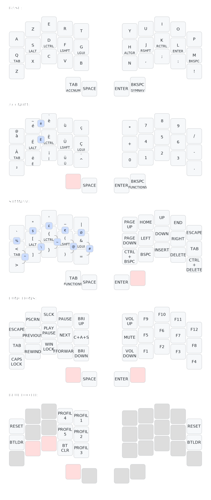

# zmk-config-sweepmx

Configuration ZMK pour Clavier Split Sweep MX avec layout AZERTY

## Layers

### Légende :

&#9634;&#9634; : Touche normale

&#9634;&#9634; : Appuyer sur AltGr en même temps

&#9634;&#9634; : Combos, presser les touches simultanément

&#9634;&#9634; : Touche maintenue

